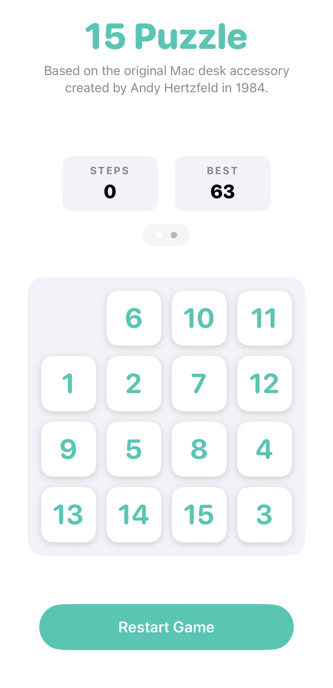
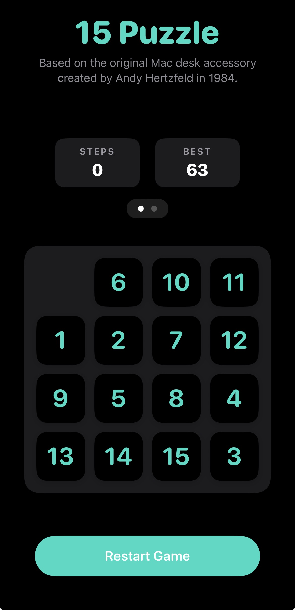
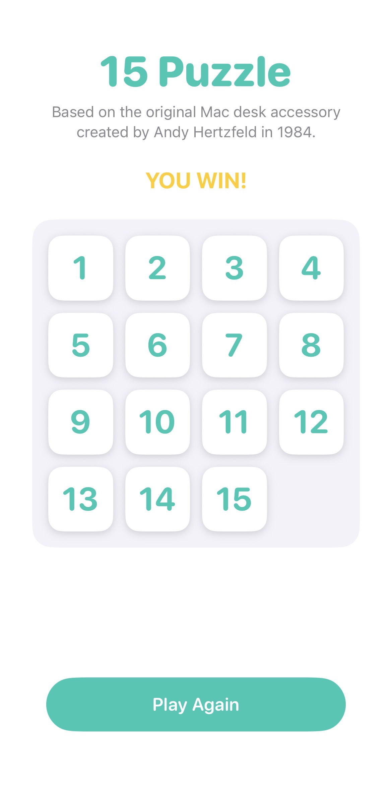
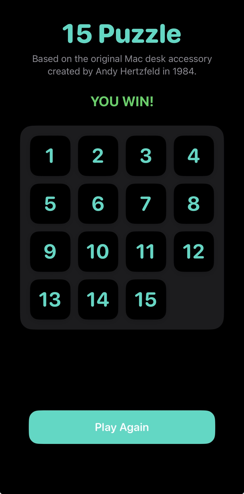

# 15-Puzzle for iOS

A modern iOS implementation of the classic sliding puzzle game, originally developed by Andy Hertzfeld as a desk accessory for the 1984 Macintosh. Built natively with SwiftUI, this project brings the nostalgic 4x4 number grid into the modern era with fluid animations and a clean interface.

## Visual Overview

Below is a look at the game in both light and dark appearances.

| Initial State (Light Mode) | Initial State (Dark Mode) |
| :---: | :---: |
|  |  |

| Win State (Light Mode) | Win State (Dark Mode) |
| :---: | :---: |
|  |  |

## How to Play

The game consists of a 4x4 grid containing numbered tiles from 1 to 15, leaving one cell blank. At the start of every game, the tiles are randomly scrambled into a solvable configuration. 

The objective is to rearrange the tiles in numerical order from left to right, top to bottom, with the blank space resting in the bottom right corner. 

To move tiles, tap or swipe on any numbered tile in the same row or column as the blank space. The selected tile, along with any adjacent tiles, will slide smoothly into the empty spot. Once the correct order is achieved, the game locks the board and displays a victory message.

## Features

* **Algorithmic Scrambling:** The game simulates 150 random valid moves from a solved state. This guarantees that every generated puzzle is 100 percent solvable.
* **Fluid Animations and Gestures:** Utilizing SwiftUI spring animations, the tiles slide naturally into place via tap or swipe gestures. The logic supports shifting entire rows or columns at once.
* **Step and Time Tracking:** Live counters track the player's efficiency. You can seamlessly toggle between step stats and time stats by swiping through a native, modern carousel. The app uses `UserDefaults` to permanently save and display your best records for both categories across sessions.
* **High-Precision Objective-C Timer Engine:** To showcase interoperability, the game's background time tracking is built entirely in Objective-C using precise `NSDate` timestamp math to eliminate background timer drift. This legacy engine is seamlessly integrated into the modern Swift UI via a custom Bridging Header.
* **Audio and Haptic Feedback:** Includes tactile vibration feedback for tile movements and custom audio cues for standard victories and record-breaking wins.
* **MVVM Architecture:** The codebase strictly separates the user interface from the game engine, ensuring a scalable and easily readable environment.
* **System Theme Support:** The interface seamlessly adapts to the system appearance settings, supporting both bright and dark modes.

## Project Structure

The codebase is organized into modular components:
* **ViewModels:** Contains `GameViewModel.swift` which handles the game state, movement validation, and scoring logic.
* **Views:** Contains `MainView.swift` for the central container and swipeable stats carousel, `HeaderView.swift` for attribution, `StatBoxView.swift` for the score counters, `GameGridView.swift` for rendering the board, and `TileView.swift` for individual cells.
* **Utils:** Contains `SoundManager.swift` to handle audio playback and memory lifecycle, alongside the Objective-C `TimeManager.h` and `TimeManager.m` classes that power the background timer logic. A Bridging Header connects this engine to the main Swift app.